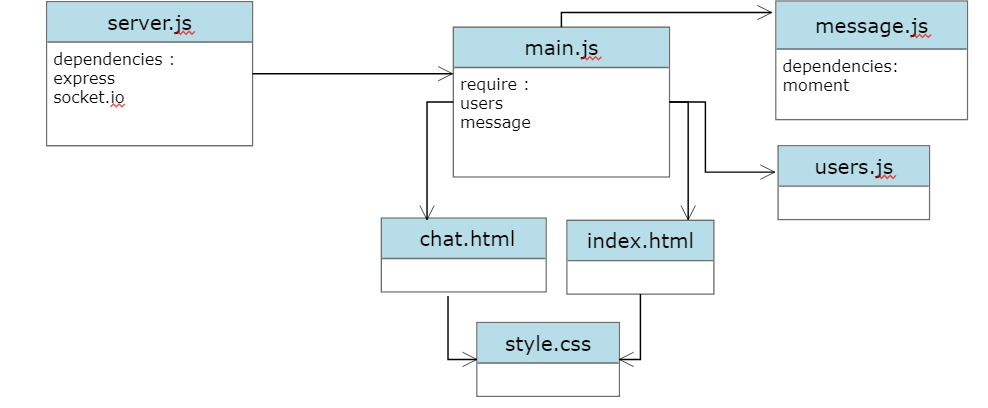

# Chat application

Realtime chat app with websockets using Node.js, Express and Socket.io with Vanilla JS on the frontend with a custom UI.

- Github Link : [Click here](https://github.com/abuobaid9/chat-app#readme)

## ***UML Diagram***

<!-- ## Team

 **WISTA Team :-**

1. Ibraheem Hammoudeh (Team Leader)
2. Wajeeh Essam
3. Samah Alsatary
4. Tasneem Maq
5. Anas Abuobaid

-->
## ***Usage***

- npm install

- npm run dev

- Go to localhost:3001

## ***Description:-***

 ***server.js:***

- regiesterd event

    1-join room

    2-chatMessage

- fired  event:

    1-roomUsers

    2-message

 ***main.js***

- regiesterd event:

    1-roomUsers

    2-message

- fired  event:

    1-joinRoom

    2-chatMessage

## ***Images***

.png)

.png)

.png)

.png)

- **if we join in another room :**

  - .png)
